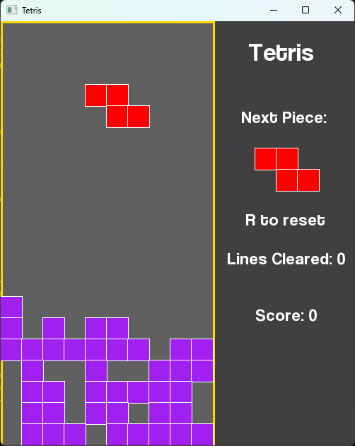

# Tetris Game

This is a simple implementation of the classic Tetris game using SFML and C++. It features music playback, display of the next piece, score tracking, and gameplay mechanics faithful to the original game.

## Features

- Background music during gameplay
- Next piece display
- Score tracking
- Game over screen

## Prerequisites

- SFML library (version 2.5 or above) installed on your system

## How to Build and Run

1. Clone this repository to your local machine:

git clone `https://github.com/your-username/tetris-game.git`

2. Build the project using a C++ compiler (e.g., GCC):

g++ -std=c++11 -o tetris Main.cpp -lsfml-graphics -lsfml-window -lsfml-system -lsfml-audio

3. Run the compiled executable:

./tetris

## How to Play

- Use the arrow keys (up, down, left, right) to move and rotate the falling Tetromino.
- Press the space bar to instantly drop the Tetromino to the bottom.
- Complete rows to clear them and earn points. The game ends when the Tetrominos stack up to the top.

## Customization

You can customize various aspects of the game by modifying the code:

- Adjust the window size, play area size, and other constants in the `TetrisGame` class.
- Change the colors, fonts, and styles used for rendering in the `render()` function.
- Add additional features, power-ups, or game mechanics to enhance the gameplay.

## Credits

This project is inspired by the original Tetris game developed by Alexey Pajitnov in 1984.

## License

This project is licensed under the [MIT License](LICENSE).
